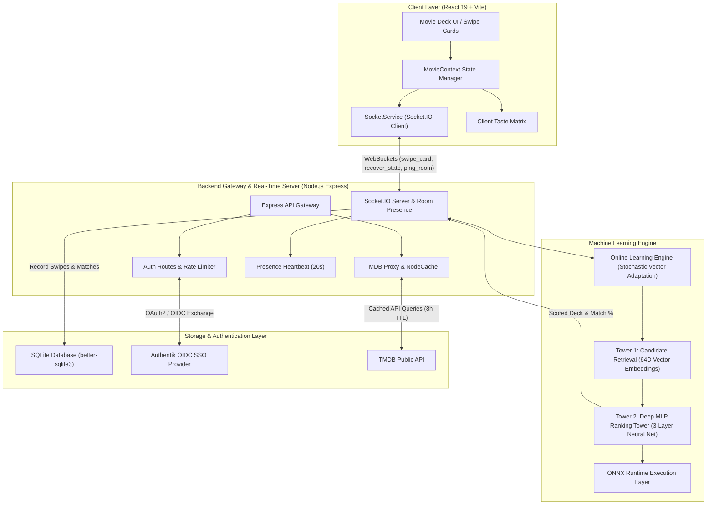

# 🎬 Movie Matcher — Real-Time State Synchronization & Neural Recommendation Platform

[](https://github.com/GIlbertoRCP/movie_match/actions/workflows/ci.yml)
[](https://nodejs.org)
[](https://react.dev)
[](https://socket.io)
[](server/ml/twoTowerEngine.js)
[](LICENSE)

**Movie Matcher** is a high-performance full-stack web application designed for real-time collaborative movie matching. It combines a **Two-Tower Neural Collaborative Filtering Engine** with **real-time online learning**, sub-millisecond **Socket.IO state synchronization**, automatic **reconnection state recovery**, and **Authentik OIDC Single Sign-On (SSO)** authentication.

---

## 🏗️ System Architecture

The following diagram illustrates how data flows seamlessly between the React client, Express API Gateway, Socket.IO WebSockets Broker, Two-Tower Machine Learning Engine, SQLite persistence layer, and external services:



---

## ⚡ Key Features

- **Two-Tower Neural Recommendation Engine**:
  - **Candidate Retrieval Tower**: Encodes movie metadata (genres, ratings, decades, latent content seeds) into 64-dimensional dense vector embeddings.
  - **Deep MLP Ranking Tower**: Evaluates user preference vectors against movie candidate embeddings through a 3-layer Multi-Layer Perceptron predicting match probabilities ($P(\text{Like} \mid U, M)$).
  - **Dynamic Online Learning**: Adapts user embedding vectors in real time over WebSockets on every swipe event using stochastic online vector updates.
- **Real-Time WebSockets Synchronization**:
  - Sub-millisecond room synchronization for live host and guest swiping sessions.
  - Instant match modal notifications whenever both users swipe right on the same title.
- **Resilient Reconnection & State Recovery**:
  - Automatic reconnection handling for client network dropouts.
  - State recovery mechanism (`recover_state`) that restores swipe history, matched movies, and session vectors directly from SQLite.
  - Room presence heartbeat checks (`ping_room`) that gracefully monitor connection status.
- **Infrastructure Security & Rate Limiting**:
  - Configured `express-rate-limit` middleware on authentication (`authLimiter`) and TMDB proxy (`tmdbLimiter`) routes to protect against brute-force attacks and API quota exhaustion.
  - Server-side in-memory caching (`node-cache`) with an 8-hour TTL for optimal performance.
- **Authentik Enterprise OIDC SSO**:
  - Seamless login integration supporting standard OpenID Connect authorization code flow with PKCE and SQLite user auto-provisioning.

---

## 🛠️ Technical Challenges Overcome

### 1. Real-Time Neural Vector Online Learning over WebSockets
- **The Challenge**: Traditional collaborative filtering models require offline batch re-training, which fails to capture rapidly changing user preferences during an active swiping session.
- **The Solution**: Implemented an online stochastic gradient vector adaptation algorithm (`updateOnlineUserVector`) operating on a 64-dimensional unit sphere embedding space. When a user swipes right or left, the active session user preference vector shifts dynamically:
  $$\vec{v}_{\text{new}} = \text{normalize}\left(\vec{v}_{\text{old}} + \alpha \cdot w \cdot \vec{e}_{\text{movie}}\right)$$
  This updates upcoming card match scores in real time without blocking the Node event loop.

### 2. Socket.IO Session Reliability, Heartbeats & State Recovery
- **The Challenge**: Mobile browser backgrounding and transient network drops frequently severed WebSocket connections, causing users to lose session state or miss instant match events.
- **The Solution**: Engineered a state recovery handshake in `socketService.js` and `server/index.js`. Upon socket reconnection, the client automatically re-subscribes to its active session code and emits a `recover_state` event. The server queries the SQLite database for persisted swipes, matches, and vectors, restoring complete room state. Added periodic heartbeats (15s) to monitor partner presence and handle cold restarts gracefully.

### 3. API Key Depletion & Rate Limiting Strategy
- **The Challenge**: Direct client requests to third-party endpoints risked API key depletion, CORS exposure, and vulnerability to brute-force authentication attacks.
- **The Solution**: Built a server-side proxy route hierarchy backed by `node-cache` (8-hour TTL) and enforced `express-rate-limit` rules (`120 req / 15m` for TMDB proxy, `50 req / 15m` for Auth).

---

## 🚀 Enterprise Feature Roadmap & Enhancements

To further enhance and scale this platform to millions of active concurrent users:

1. **Neural Vector DB Candidate Retrieval**:
   - Integrate **Milvus** or **Qdrant** vector databases to execute sub-millisecond approximate nearest neighbor (ANN) HNSW vector queries across catalog embeddings.
2. **N-Way Group Swiping & Pareto Matching**:
   - Extend 2-player room sessions into N-player group recommendation sessions utilizing Pareto-optimal social choice aggregation algorithms to find consensus movies for parties and families.
3. **Cross-Platform Native Apps**:
   - Package the React frontend with **Tauri Mobile** / **React Native** for iOS and Android deployment with offline SQLite local sync.
4. **Streaming Provider Deep-Linking**:
   - Integrate **JustWatch API** to surface direct 1-click watch links (Netflix, Prime Video, Disney+, Max) based on the user's geographic region.

---

## 🧪 Testing & CI/CD

### Running Unit Tests
```bash
# Execute unit test suite for ML vector math, online learning, and recommendations
npm test
```

### Code Quality Checking
```bash
# Run oxlint static analysis across frontend and backend codebase
npx oxlint
```

### CI/CD Pipeline
Continuous Integration is configured via [.github/workflows/ci.yml](.github/workflows/ci.yml). Every push and pull request automatically triggers:
- Node.js 20 environment initialization.
- Dependency installation (`npm ci`).
- Oxlint code quality verification.
- Backend server syntax checks (`node --check`).
- Automated unit test suite execution.
- Production bundle verification (`npm run build`).

---

## 📦 Quick Start Guide

### Prerequisites
- **Node.js**: v18.x or higher
- **npm**: v9.x or higher

### Installation & Local Setup

1. **Clone the repository**:
   ```bash
   git clone https://github.com/GIlbertoRCP/movie_match.git
   cd movie_match
   ```

2. **Install Root & Server Dependencies**:
   ```bash
   npm install
   cd server && npm install && cd ..
   ```

3. **Start Development Servers**:
   ```bash
   # Terminal 1: Backend Server (Port 5001)
   cd server && npm run dev

   # Terminal 2: Frontend App (Port 5173)
   npm run dev
   ```

4. **Open Application**: Navigate to `http://localhost:5173` in your browser.

---

## 📄 License

This project is open source and available under the [MIT License](LICENSE).
